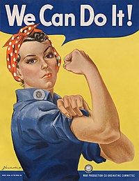
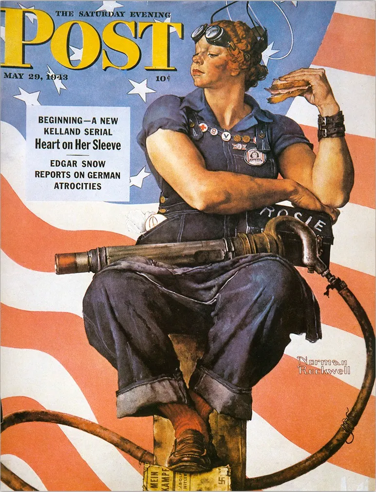

# **Women during second World War**

### **War**:

The second world war was a global war wich took place between **1939** and **1945**.

On **December 1941**, **Roosevelet** declared the war against the axis because **Pearl Harbor** has been attacked. **Men gone to war**

---

### **Women**:

The **US government** called women to join the workforce to replace men who had gone to war. **6 millions answered that call**

---

### **Propaganda**:

To incite women to work in war industry, the US government used propaganda.

### Howard Miller's Rosie:

The most famous propaganda poster was made by J.Howard Miller.

 

*Rosie by Howard Miller*

It shows a women in factory uniform wearing a bandana and having her arm dressed.

She is saying `We can do it!`. It means she is sure women can remplace men in factories and be as strong as them and more

---

### Rosie by Norman Rockwell:

The famous painter Norman Rockwell also made a paiting in 1943

*Norman Rockwell's Rosie*

His painting shows a proud and determined woman with strong arms, wearing men shoes and blue jumpsuit. She has a riveting gun on her arm and Hitler's Mein Kampf below her foot. She is represented with a halo like a Holy Saint.

**She is inspired by a fresco by Michelangelo on Sixtine Chapel**

---

### **Rosie**:

* Rosie was not one woman, it's the name given **to hundred of women** who joined the war industry during **WWII**
* A Rosie is a strong, proud and patriotic but feminine worker who accomplished her civic duty and participate in the war effort

---

### How Rosies became so populate ?
In **1943**, the term was originally used in a [song](https://www.youtube.com/watch?v=2csVk8IE3tE) by Redd Evans and John Jacob Loeb called *Rosie the Riveter* and became popular nationwide.
The song talks about a determined assembly line worker who was partaking in war effort. The name has been taken from Rosie Bonavitas who worked for Convair in **San Diego, California**

---
### The Real-Life Rosies

* `Rosalind P.Walter`, the inspiration for the song, worked late nights at factory

* `Rose Will Monroe`, worked as a riveter in the Willow Run Aircraft Factory Building **B-29** and **B-24** bombers, she was asked to star as **Rosie** in promotional videos and posters

---

### **Women at work**
- `Rosie the Riveter` inspired more women to help the war effort (Encyclopedia of American History)
- Women working in factories increased by **57%** from **1940** to **1944**
- The estimed increase of the proportion of jobs that would be "acceptable" for women was raised by employers from 29 to 85%